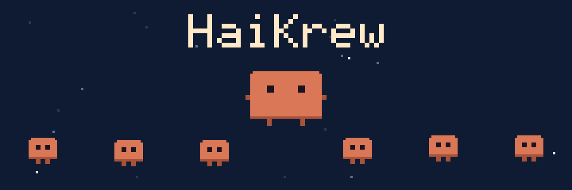

# HaiKrew



HaiKrew is a Claude Code mod (plugin) for token-efficient agent crews. The main model plans and reviews; cheaper Haiku subagents write code and do research; deterministic hooks gate which model a subagent runs on and trim noisy command output before it reaches the context.

Unofficial community plugin; not affiliated with Anthropic.

## Why

A subagent launched without a `model` inherits the main model, so every default agent runs on the most expensive model. HaiKrew routes code-writing and research to Haiku, keeps the main model on planning and review, and cuts noisy output deterministically (a hook shortens build logs; it does not ask a model to summarise them).

## What's inside

- **Model gate** (`agent.spawn`): sets a model on every subagent launch that lacks one, and refuses Opus unless allowed.
- **Squeeze** (`tool.call` on Bash): runs noisy commands such as `cargo test` or `xcodebuild` through `haikrew squeeze`, which prints a short verdict and keeps the full log on disk.
- **Read guard** (`tool.call` on Read): a large file read without a line range returns an outline and asks for a range.
- **Ledger** (`classic.SubagentStop`): one row per finished subagent (model, job, language, time, tokens, verdict). The newest 200 rows are kept in full; older rows fold into monthly averages, and monthly averages older than 12 months fold into yearly ones.
- **`/haikrew` pane**: three tabs. Settings, Ledger, and Tokens.
- **`haiku-coder` agent**: implements a tightly written spec.
- **`haiku-scout` agent**: answers one research question with a short cited brief.
- **`crew-overseer` skill**: the overseer workflow: write the spec, dispatch Haiku, verify.
- **CLI** (`bin/haikrew.mjs`): `squeeze`, `verify`, `stats`, `patterns check`.

## Requirements

- Claude Code 2.1.287 or later (for mods and `plugin test`).
- Node 22.18 or later for the CLI. The CLI runs TypeScript directly through Node's type stripping and has no build step or dependencies.

## Install

Try it for one session:

```sh
claude --plugin-dir /path/to/HaiKrew
```

Install from GitHub:

```text
/plugin marketplace add adriancmurray/HaiKrew
/plugin install haikrew@haikrew
```

The marketplace is named `haikrew` and lists one plugin, `haikrew`, defined in `.claude-plugin/marketplace.json`.

## Settings

Defaults come from `src/schema.ts`. Values are validated on save.

| Key | Default | What it does |
|---|---|---|
| `gate.enabled` | `true` | Turn the gate on or off. |
| `gate.default_model` | `"haiku"` | Model given to an agent launched without one. |
| `gate.allow_opus` | `false` | Allow subagents to run on Opus at all. Off: an Opus request is refused with a reason. |
| `gate.pinned_types` | `["haiku-coder"]` | Agent types whose own definition sets the model; the gate leaves them alone. |
| `squeeze.enabled` | `true` | Redirect matching commands. |
| `squeeze.patterns` | 7 regexes (cargo, swift, xcodebuild, pytest, npm/pnpm/yarn/bun, go, make) | Regexes matched against the start of a Bash command. |
| `squeeze.max_lines` | `20` | Most lines a summary prints. |
| `squeeze.wrap_prefix` | `""` | Optional command prefixed to every squeezed run, e.g. a build lock wrapper. |
| `read_guard.enabled` | `true` | Turn the guard on or off. |
| `read_guard.max_lines` | `600` | Files longer than this need an offset/limit. |
| `ledger.enabled` | `true` | Record finished subagents. |
| `ledger.raw_limit` | `200` | Newest rows kept in full; older rows fold into monthly averages. |
| `ledger.yearly_after_months` | `12` | Monthly averages older than this fold into yearly ones. |
| `patterns.max_files` | `20` | Most pattern files allowed. |
| `patterns.max_lines` | `40` | Most lines per pattern file. |

## How the crew works

1. The overseer (the main model) writes a spec that fits on one screen. Its first line is the header `HAIKREW job=<word> lang=<word>`.
2. `haiku-coder` implements the spec in a worktree, runs `haikrew verify`, and reports in 120 words or fewer.
3. `haikrew verify` runs the repo's `.haikrew/verify` script if present, or an inferred build and test, and prints one `VERDICT:` line. The overseer reads that line and the risky diff hunks, not the transcript.

## Limitations

- The `agent.spawn` field names come from the published Claude Code mod types. They have not been exercised against a live Claude Code session yet.
- The mod parts (gate, guards, ledger, pane) run only in Claude Code. The CLI (`squeeze`, `verify`, `stats`, `patterns check`) runs anywhere Node 22.18 or later runs.
- `haikrew stats` reads local transcripts only.
- The squeeze hook matches the start of a command with a regex.
- The read guard and squeeze are heuristics. They can truncate output a caller needed; the full log stays on disk for squeezed runs.

## License

MIT. See [LICENSE](LICENSE).
